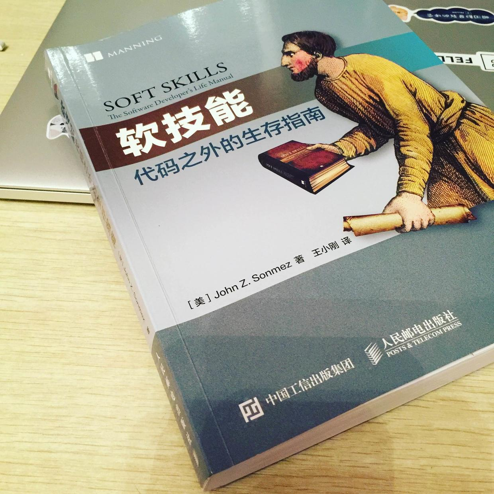

# 《软技能-代码之外的生存指南》书摘简评

作者 John Z.Sonmez 在这本书中分享了他作为开发者在职业发展、自我营销、元学习、工作效率、理财健身以及爱情与精神修养等诸多方面的体会与经验，可谓名副其实的“程序员生存指南”。

## 职业发展

> 每个阶段都只记住一件事：当好自己的 CEO

* 从非同凡响开始，不要做他人都在做的事 —— `想想自已一贯如此` 😝
* 拥有商业心态，像企业一样思考 —— `这与“五分钟商学院”的 Slogan 不谋而合, 人人都是自己的CEO。`
* 人际交往能力：远比你想象的重要 —— `嗯！放下那颗小玻璃心，展现自己的社交价值，想撩谁就去尽管去撩吧!`
* 就业选择 —— `雇员？独立咨询师？创业者？最后终点是什么并不重要，确保自己始终在路上`
* 你是哪类软件开发人员 —— `一专多能，请先有一项真正的专长`
* 攀登晋升阶梯 —— `主动承担责任，并引人注意，先后主次别搞乱了，不断地学习，成为 trouble dealer`
* 成为自由职业者 —— `这很酷，也很苦，一定先做好各项准备`
* 创建你的第一个产品 —— `为自己写代码，就不能够仅仅只是写代码了`
* 你打算开始创业吗？ —— `是的！等先把自己的 CEO 做到极致了`
* 远程工作的生存策略 —— `直面时间管理、自我激励与孤独感这样的挑战`
* 假装自己能成功 —— `嗯！这一招我也常用，难点在于被鄙夷后仍付出行动，装就装到位，争取出演下一个更厉害的角色，直到别人以为你在假装失败。`
* 润色你的简历 —— `比别人多做一点点，不浮夸也别埋没了自己`

## 自我营销

> 营销就是一场争夺人们注意力的竞赛 —— Seth Godin

* 基础课 —— `这很重要，放下对‘营销’的偏见，以博客起步，开始分享吧，很多人都喜欢向只比自己稍微优秀一点儿的人学习，可不嘛~`
* 打造引人注目的品牌 —— `品牌的承载信息、一致性、视觉符号、曝光率，花点儿时间想想。嗯！这就是你能听到市场部常挂在嘴上的 branding`
* 创建大获成功的博客 —— `持续分享输出有价值的内容，正如你从诸多博客所收获的，而后 branding，起码别浪费了购买的服务器流量`
* 主要目标：为他人增加价值 —— `“不要努力成为一个成功的人，而要努力成为一个有价值的人。” ，思利及人`
* 善用社交媒体 —— `制定一份社交媒体改进计划！`
* 演讲、报告和培训：做“说话的极客” —— `刻意练习，克服恐惧，抓住机会，创建短时培训课程，制造机会的同时创造价值`
* 著书立说，吸引追随者 —— `整理出版你能为他人所带来的价值`
* 百折不挠，越挫越勇 —— `小步快跑，别再停了！`

## 学习

> 教育就是当一个人把在学校所学全部忘光之后剩下的东西 —— 阿尔伯特·爱因斯坦

* 学习怎样学习：如何自我教育 —— `这不就是李笑来的“学习学习/再学习”吗？即“元学习”。不在于“知”而在于“行”`
* “十步学习法” —— `可以总结适合自己的学习法`
>  1. 了解全局
>  2. 确定范围
>  3. 定义目标
>  4. 寻找资源
>  5. 创建学习计划
>  6. 筛选资源
>  7. 开始学习，浅尝辄止
>  8. 动手操作，边玩边学
>  9. 全面掌握，学以致用
>  10. 乐为人师，融会贯通

* 寻找导师：找到你的尤达 —— `为了获取导师的帮助，你能给他提供什么？`
* 开山收徒：成为尤达一样的大师 —— `持续提升自己`
* 传道授业：若要学知识，必得为人师 —— `将“好为人师”作为发现自身短板的途经`
* 你需要一个学位吗？ —— `还处于休学状态的我，将持续思考这个问题，直到这不再是个问题`
* 发现自己的知识短板 —— `遇到不明白的地方都记下来，解决日常中的痛点`

## 生产力

> 外行静坐等待灵感，其他人则唤起激情努力工作。—— 斯蒂芬·金

* 一切始于专注 —— `体会关注，记住“关注感”`
* 我的私房“生产力提升计划” —— `找到“关注感”，制定自己专属的“生产力提升计划”。《看板实战》`
* 番茄工作法 —— `正在尝试，确实有所起效，只是还有待培养成习惯`
* 我的“定额工作法” —— `关注需要重复做的任务，每周定额完成，持续推进`
* 对自己负责 —— `没有什么比先达到这一步更提高效率了`
* 要不要多任务并行 —— `不要陷入无尽的任务切换陷阱，做到真正的多任务并行；一次性批量处理小任务，不要每天或每周做多次`
* 职业倦怠：我已找到解药 —— `仅仅是强迫自己，再多走一步，“穿越那堵墙”`
* 时间是怎样被浪费掉的 —— `跟踪你的时间，瞧一瞧`
* 形成惯例的重要性 —— `就像每天早上醒来第一件事，要抢在别人之前去蚂蚁森林收取能量`
* 分解任务：如何吃掉一头大象 —— `“万丈高楼平地起”，“千里之行始于足下”，这些平实的道理总是适用`
* 努力工作的价值 —— `或者换个角度想，正如李笑来说的那样，为你的工作找到价值和意义，就不存在还需要努力了`
* 任何行动都比不采取行动好 —— `这个议题真的点亮了我，因为我总是想在做某件事之前就一定要把这件事考虑周全，但凡预见有困难，准备阶段便不断延长。以后要切换到“Just do it”`

## 理财

> 金钱只是一种工具。它会带你去往任何你想去的地方，但不会取代你成为司机。 —— 爱思·然德（Ayn Rand）

* 怎样支配你的薪水 —— `拒绝短期思维，理清资产与负债，不亏待自己的前提下，多思考长远的价值提升`
* 怎样进行薪酬谈判 —— `清楚地认识自己的价值；薪酬谈判始于求职之前，即让自己的价值看得见；获得工作的方式至关重要`
* 期权：所有乐趣之所在 —— `期权即赋予你在未来某个日期之前以固定价格购买一定数量股票的权利`
* 房地产投资面面观 —— `可能的话，投资租赁房产`
* 你真的了解自己的退休计划吗？ —— `答：不是真不真的问题，是压根不了解🙂；所以，只能选择 Plan B —— 致富了`
* 债务的危害：社保债务代价昂贵 —— `嗯~尤其在现在老龄化日益加剧的中国`
## 健身

> 人的身体就是人的灵魂的最好写照。——路德维希·维特根斯坦

* 为什么需要破解自己的健康密码 —— `自信心、让大脑获得更强的力量……更健康地活着需要理由吗？`
* 制定健身目标 —— `并坚持下去`
* 让你的屁股离开椅子 —— `去跑步机上听播客和有声书吧，站立办公是个不错的主意`
* 如何增长肌肉：书呆子也能拥有强健的肌肉 —— `谁是书呆子了？！说谁呢！`
* 如何获得完美腹肌 —— `降低体脂率？嘻嘻😄`
* 启动跑步程序 —— `真的！跑步真的太棒了！只是，这段时间还是等北京的霾降下去一点再说吧`

## 精神

> 如果你不征服自己，你就会被自己征服。 —— 拿破仑·希尔

* 心灵是如何影响身体的 —— `这仿佛是在问，这段代码对程序有什么影响。——我只知道没有它，就运行不了`
* 拥有正确的心态 —— `审视你的思维日志`
* 构建一个积极的自我形象 —— `学习一门类似“占星术”这样的心理语言，对你的大脑“重新编程”，你以为的那个你就是那个你以为的那个你，you made it`
* 爱情与恋爱：计算机无法牵着你的手 —— `计算机无法牵着你的手~计算机无法牵着你的手~~计算机无法牵着你的手\~\~\~\~😄`
* 积极面对失败 —— `这一节紧接在“爱情”的主题之后，仿佛有什么深意🤔`