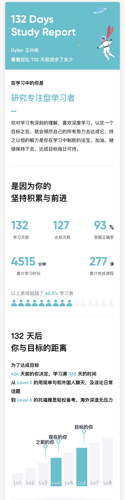
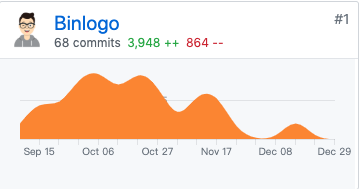

# 2019 造风蓄势，2020 扬帆起航

又是一年雪落纷飞时，尤其 2019 年的年关来得格外早，恰逢看到 [掘金年度征文 | 2019 与我的技术之路 征文活动](https://juejin.im/post/5e08c4fb51882549a05815ea)，索性早些着手今年的年终总结与新年计划。趁此机会也调整下风格，相比[以往](https://binlogo.github.io/tag/RSKtfnQId/)只是作为思考写给自己看，这次尝试辅助些量化自我的数据，写得丰富些。

## 年初计划回顾

今年定的计划目标非常简要，就是「给自己更多沉淀的时间，修炼并扎实内功，做些如果不做的话 5 年甚至 10年 后仍然会后悔当初不早点做的事」：

* 英语口语达到日常沟通交流无障碍，自然而流畅。

* 深入扎实算法、网络协议等计算机基础内功

* 基于以上逐步由积累向外输出

### 英语口语（自评：☆☆☆☆）

这一点虽说和技术不是强相关，我却始终将其视为最最基本的元能力之一，不论是对于快速了解前沿的技术领域，还是突破自身技术提升的瓶颈，都是大有裨益的。正是由于英语是如此的基础，加之其作为一门语言的特有习得特性，几乎每年都会保持一定投入。

下半年觉得机器对话太过冰冷，便换成了开言，真人对话学习更有温度些。

虽说离目标「日常沟通交流无障碍，自然而流畅」还有些距离，但确是利索了许多，告诉自己，十年后的这棵树正在茁壮成长，持续浇水便是。

### 计算机基础内功（自评：☆☆☆）

针对这一点，一来是深知自己是出于一腔热血辍学入的行（想了解更多的朋友可参看[《行·知·在路上》](http://learnext.cn/post/experience-and-knowledge-on-the-road/)），基本功难免欠缺，但非科班不应该成为托辞，反而是要付出更多的努力才能够站到同一起跑线；二来工作上的挑战越来越大，真真切切地体会到算法、网络协议等基础知识的重要性。

#### 算法

没有什么特别的技巧，就是锚定了一门课，并且在 LeetCode 按**数据结构**和**算法**分门别类进行练习，并在 GitHub 进行沉淀记录（GitHub: [LeetCode-Swift-Track](https://github.com/Binlogo/LeetCode-Swift-Track)）。

#### 技术基本功相关的阅读与课程

* 《深入理解计算机系统》——100%，☆☆☆☆☆
* 《架构整洁之道》——100%， ☆☆☆☆
* 《Socket网络编程进阶与实战》——70%，☆☆☆
* 《大话计算机》——10%，☆☆☆
* 《深入解析Mac OS X & iOS 操作系统》——30%，☆☆☆☆
* 《UNIX网络编程-卷1:套接字联网 API》—— 20%，☆☆☆☆

### 由积累向外输出（自评：☆☆☆）

* [Swift Unsafe Part - 「危险的 Swift 」指北](https://juejin.im/post/5d7c2207f265da03ea5aabf7)
* [一份 iOS 开发实践检查清单](https://juejin.im/post/5d7e1a9de51d453b8b5fa679)，在此感谢知识小集的认可与转载
* [源码剖析：探究 Repeat 中 GCD 的应用](https://juejin.im/post/5db6f399f265da4cf85d6ef9)
* 另外，开了一个小专栏：[《彻底搞定 GCD🚦并发编程》](https://xiaozhuanlan.com/complete-ios-gcd)
* 恢复了个人博客：[彬少の原野](https://binlogo.github.io/)

## 计划之外的一些达成

总结回顾最最有趣的部分就是计划之外的一些事的达成了。

* 与港港一同马来西亚 · 沙巴 7 日游，解锁滑翔伞、萤火虫之夜等多项成就
* 习得了一门新语言：Rust，参阅 [GitHub Exercism-Rust-Track](https://github.com/Binlogo/Exercism-Rust-Track)
* 开始坚持冥想，并从中受益良多，参阅《[练就「幸福力」](http://learnext.cn/post/meditation-keep/)》
* 在同事的陪伴与互相督促下坚持并养成了锻炼的习惯，并解锁全身健腹轮等多项技能
* 开始练习街舞 Hip-Pop，四肢协调中
* 在父母的帮助下完成了一套房的装修

## 2020 新年展望，扬帆起航

人生是一场无限游戏，如何将其不断延伸，这是明年以及很长一段时间要去思考的。莫名有种预感又或者是期望吧，想必 2020 年大环境会是逐渐回暖，由逆风逐渐转向顺风。若是如此，在这样的一个阶段，除了仍须沉下心修炼内功，坚持浇灌好 5 年甚至 10 年后的大树以外，还需要把握好机会，抓准时机做对的事。（Do Right Things vs. Do Things Right）

* 英语口语的提升，目标具体化，拿到至少 1 个结果，或考证或以此把握机会做出些成绩
* 继续提升技术的基础上，产出至少 1 个代表作品，并在工作上更上一层楼
* 突破并探索更广阔的世界，完成至少 1 次旅行徒步
* 做好进入人生下一阶段的准备（若量化的话：求至少 1 次婚 or 结至少 1 次婚？😜

## 附：往年总结与展望

- [2018 助推，2019 沉淀](https://binlogo.github.io//post/reflection-and-resolution-2018-2019)
- [2017 如期而至，2018 携手并进](https://binlogo.github.io//post/reflection-and-resolution-2017-2018)
- [2016 你没来，2017 我过去 —— 在顺境中反省](https://binlogo.github.io//post/reflection-and-resolution-2016-2017)
- [2015 返璞，2016 归真](https://binlogo.github.io//post/reflection-and-resolution-2015-2016)
- [再思，学与行](https://binlogo.github.io//post/reflection-and-resolution-2014-2015)
- [去逃避，去忘记，直到无法呼吸？](https://binlogo.github.io//post/reflection-and-resolution-2013-1014)

