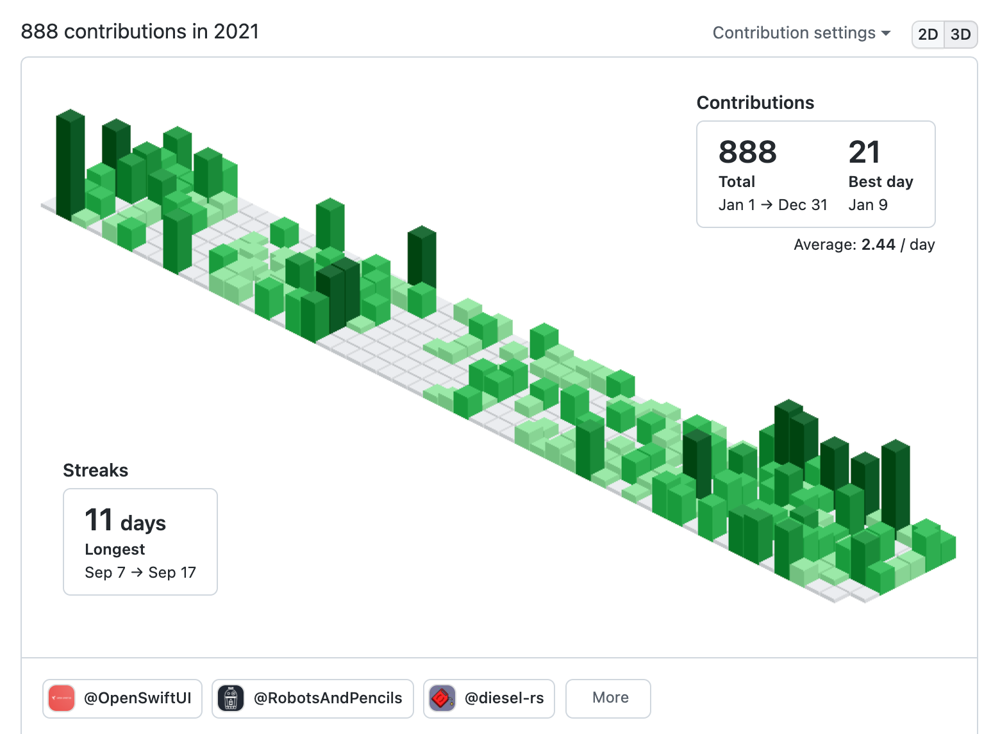
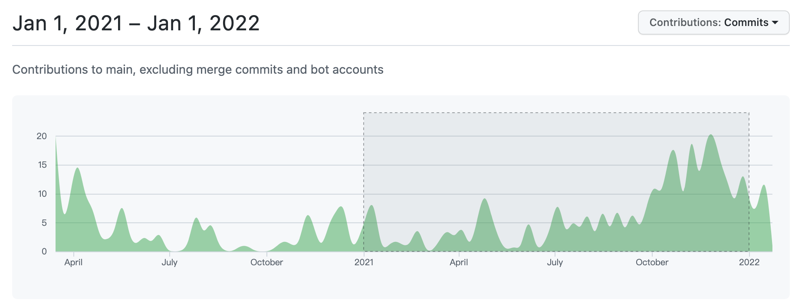
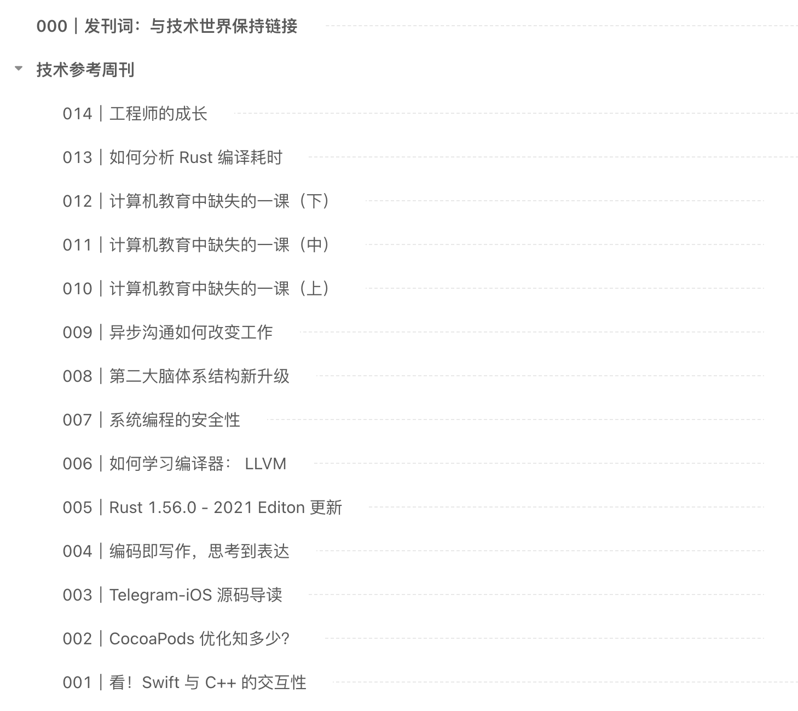
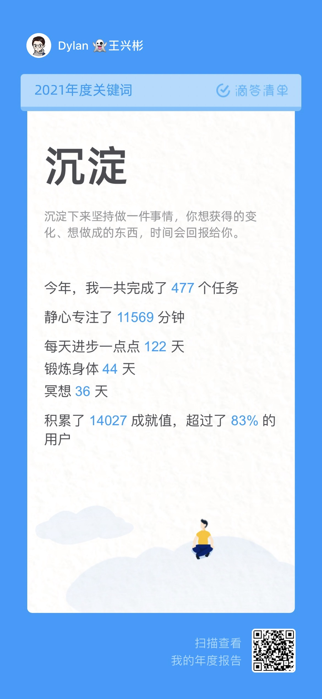
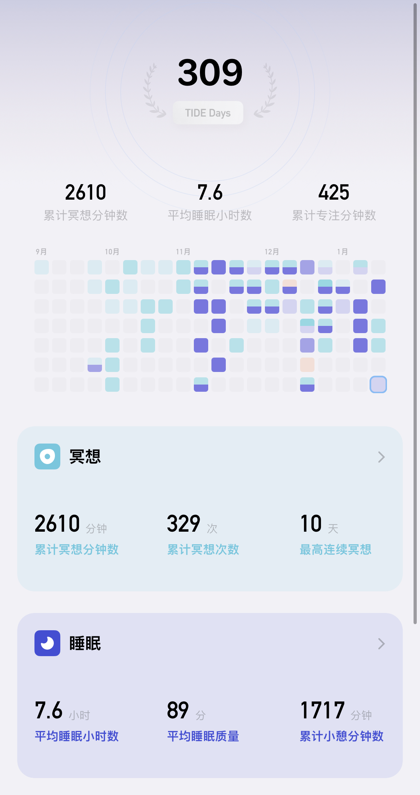
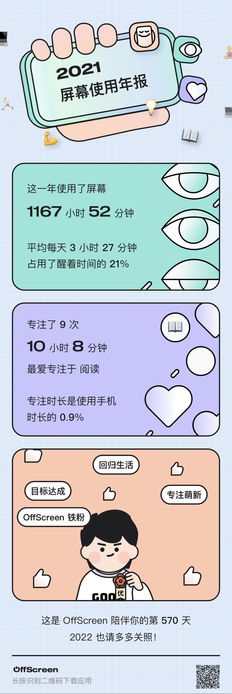
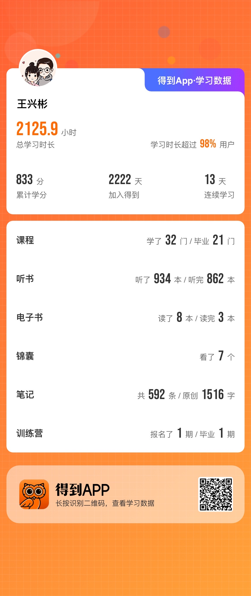

# 2021 重归「故地」，2022 静享春风

2021 年的一些关键字：

- 个人成长：「坚持」、「小习惯」、「第二大脑」、「技术参考周刊」
- 感情生活：「从异地到团聚」、「从一度分手到迈向婚姻」、「从深圳重回北京」
- 健康爱好：「游泳」、「滑雪」、「健身环」
- 职业生涯：「iOS ❤️ 工程&效率&架构」、「转岗 Rust」、「字节跳动&剪映&飞书」

第二大脑概念的践行，可以说是我这两年最看得见摸得着的坚持与付出了，虽然没有给我带来几乎任何实质性的外部收益，譬如「GitHub」的 Star 数，甚至于哪怕一个内推简历，更不用说其他像付费打赏这些更实际的了；但是自己却仍是乐在其中，因为这对于自己个人的成长与沉淀，是十分显而易见的，尤其我还是一个不太爱记事儿的人。

这一年，在看到「[Increment](https://increment.com/)」这个 Stripe 出品的技术期刊时，受这个期刊名启发，想着可以在更新维护第二大脑的同时，以知识增量的方式，从时间维度也衍生出一个技术参考周刊，做些简单的输出和分享。「[棒棒彬·技术参考周刊](https://www.yuque.com/binboy/increment-magzine)」应运而生，目前已更新了 14 期，给自己定的一个小目标是先到 100 期，因此 2022 年这个小习惯仍会继续坚持下去。

相信也正是由于自己的点击沉淀与积累，才有机会在这一年从 iOS 开发转岗到挑战更广阔更多可能的 Rust 跨平台开发领域，也是这一年最大的变化，一切都是新的，调动成长型思维「面对疾风吧」。

## 回顾与总结

### GitHub

包括第二大脑等一切能通过「泛代码」的形式在 GitHub 上托管的，基本都在 GitHub 了，除此之外只是十分零星地做了些开源贡献。因此，GitHub 的统计基本就能反映这一年在工作之外整体的一些点滴积累与沉淀过程。

#### Knowledge-Track（第二大脑）

其中，不难看出 2021 年在意识到其对个人成长的重要性后，形成了一定的正向反馈。

#### 技术参考周刊

出发就意味着可能，再接再厉。

### 滴答清单

日常工作和生活，重度使用滴答清单进行时间管理，包括习惯和进度跟踪，虽然肯定会有不少遗漏，但是能在一定程度量化这一年。尤其，我非常喜欢滴答清单给自己的 2021年度关键字——「沉淀」。

### 潮汐冥想

「[幸福力](https://binlogo.github.io/post/meditation-keep/)」将会是人生中需要不断锻炼的一种至关重要的能力，这关乎如何过好这一生。和大多数人一样，我是个无神论者，因此没有什么狭义的信仰，当我了解到有冥想这把「秘钥」，便自然而然喜欢上了。

### 放下手机，认真生活

OffScreen 是一款屏幕时间追踪的工具，尤其是适当的「外部提醒」，的确让我在很大程度上减少了对手机的依赖，不过，看起来依然还有非常大的可压缩空间。

 

### 得到·通识

通勤等大多数碎片时间基本都是由「得到」陪伴，确切地说是吴军、陈海贤、万维钢、古典等老师的陪伴。这些课程对于一部分人来说，没什么用，又或者对另一部分人当作是焦虑的解药，成长的「秘籍」，我不确切自己属于哪一部分，但是我明确知道的是，学习这些「远处的知识」过程本身对于自己而言就是十分享受且愉悦的，这就够了，希望得到越办越好。

## 新年展望

人在世界浪潮的洪流中总是显得渺小而无力，疫情常态化已然让时间的脚步变慢，也让年与年的界限变得模糊了起来。让人真正意识到平安顺遂即是福，这一年不打算立什么宏大的目标，只是享受去坚持一个个小习惯，感受一个个看似微不足道的当下。

- Daily：
  - 晨间：广泛阅读·工作安排
  - 午间：散步锻炼·冥想休息
  - 晚间：散步锻炼·总结沉淀·专精阅读·娱乐休闲
  - 其他：
    - 喝够 1L 水
- Weekly：
  - 三餐：享受下厨的美好时光
  - 至少一日外出
  - 周日：更新技术参考周刊

