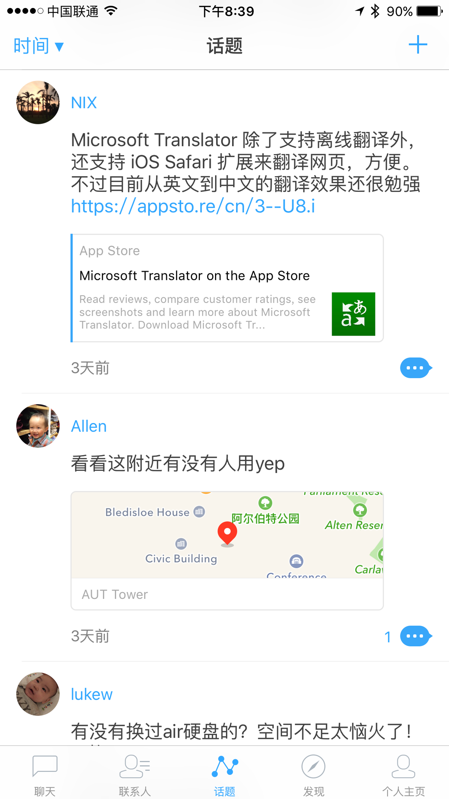

# Yep 学习之旅 - Podfile 篇

## Yep - 遇见天才，成为天才的地方

> “Yep 是一款非常小巧而轻量化的社交 App，围绕「遇见天才」这个主题，让用户去找到领域中的精英或者是正在一起学习的人。” ——官方简介

从产品的角度，我觉得它很好地把朋友圈的概念提炼加工，通过“遇见天才”这个主题，依据不同领域、地理位置等来筛选匹配相对应的朋友圈，并将“评论”转换为话题讨论，很好地做到了轻量而高效的社交体验。

更赞的是Catch Inc团队将整个[Yep](https://github.com/CatchChat/Yep)开源出来了，既能吸引天才们一同参与贡献，也能帮助向着天才进发的童鞋学习成长。`再来一个顶级赞，镶钻的那种。👍+💎`

话不多说，赶紧去App Store下载,来到Yep的世界就对了！当然了，iOS开发者们，也一定别忘了去Github关注这个优秀的开源项目。

## Podfile 学起

以下就是Yep项目中的Podfile中的pods

    def pods
        pod 'Kanna'
        pod 'Navi'
        pod 'Appsee'
        pod 'Alamofire'
        pod 'DeviceGuru'
        pod '1PasswordExtension'
        pod 'KeyboardMan'
        pod 'Ruler'
        pod 'Proposer'
        pod 'FXBlurView'
        pod 'Kingfisher'
        pod 'TPKeyboardAvoiding'
        pod 'pop'
        pod 'Base64'
        pod 'SocketRocket'
        pod 'RealmSwift'
        pod 'MonkeyKing', '0.0.2'
        pod 'JPush-iOS-SDK', '1.8.8'
        pod 'Fabric'
    end
可以看到，里面随便一个框架，光是介绍就可以写好几篇长文，但我们这回就走马观花一趟，看看在做项目的时候，有哪些功能模块是通过优秀的第三方开源库来完成，以便腾出足够的时间在核心业务功能快马扬鞭~

### Kanna - XML/HTML的解析框架

通过搜索源码可以看到，Yep项目中只有`OpenGraphService.swift`中用来解析HTML，来获取其中的`meta`以及其中的`property`、`content`，还有`site_name`、`title`、`description`、`image`等属性，这样就可以在话题中优雅地展示Github、Drribbble、简书包括Apple Ebook、Apple Music、Apple Movie等各种分享链接了。

    if let doc = Kanna.HTML(html: HTMLString, encoding: NSUTF8StringEncoding) {
    
            var openGraph = OpenGraph(URL: URL)
    
            if let metaSet = doc.head?.css("meta") {
    
                var openGraphInfo = [String: String]()
    
                for meta in metaSet {
                    if let property = meta["property"]?.lowercaseString {
                        if property.hasPrefix("og:") {
                            if let content = meta["content"] {
                                openGraphInfo[property] = content
                            }
                        }
                    }
                }
    
                openGraph.siteName = openGraphInfo["og:site_name"]
    
                openGraph.title = openGraphInfo["og:title"]
                openGraph.description = openGraphInfo["og:description"]
    
                openGraph.previewImageURLString = openGraphInfo["og:image"]
                 ……
    }

解析处理之后，展示出来的效果：

### Navi - @nixzhu打造的“纳美人”

这是一个头像（Avatar）缓存组件，[@nixzhu](http://)也专门写了一篇文章详实介绍了打造这款轮子的始末，详情可移步[《一种头像缓存策略》](https://github.com/nixzhu/dev-blog/blob/master/2015-10-08-navi.md)

### Appsee - App统计分析神器

这是一款支持点击热图和用户记录的统计分析框架，针对产品的市场分析和迭代改进非常有帮助，它是付费的，所以有需要的童鞋可以去[Appsee官网](https://www.appsee.com/)详细了解，获取支持。

### Alamofire - Swift语言下必备的优雅网络框架

如果你在写OC的时候离不开AFNetworking，那么转战苹果下一代语言Swift的时候你就同样离不开[Alamofire](https://github.com/Alamofire/Alamofire)，必掌握无疑。

### DeviceGuru - 简单快捷的“设备识别器”
以下是它全部的用法介绍，是不是简单快捷而高效呢？
> If you install from CocoaPods, you have to import the module. If you used drag and drop then there is no need of import

    import DeviceGuru 
> In your code:

    let deviceCode = DeviceGuru.hardwareString()
    let deviceName = DeviceGuru.hardware()
    print("\(deviceName) - \(deviceCode)") 
    //Ex: IPHONE_6S_PLUS - iPhone8,2

### 1PasswordExtension

想必许多人都了解或用过1Password，方便、安全的密码管理软件。还是学生的时候买不起，就选择了同样优秀的LastPass，所以等到1Password限免的时候买了，但因为习惯，所以仍然还是在用LastPass。哎呀~！扯远了。言归正题，可以看出来，Yep团队是非常有Geek追求的，在应用中集成了这个密码管理插件。那么，也赶紧学着做个Geek的开发者吧。[Github-1PasswordExtention](https://github.com/AgileBits/onepassword-app-extension)、[《在自己的项目中嵌入1Password》](http://sunxiang0918.cn/2015/11/30/%E5%9C%A8%E8%87%AA%E5%B7%B1%E7%9A%84App%E4%B8%AD%E5%B5%8C%E5%85%A5onePassword%E5%AF%86%E7%A0%81%E7%AE%A1%E7%90%86/)by翔妖除魔

### KeyboardMan - 又一个Yep作者打造的优秀轮子

其主要用于方便处理键盘通知，也同样有一篇[文章](https://github.com/nixzhu/dev-blog/blob/master/2015-07-27-keyboard-man.md)讲述介绍。

### Ruler - 这不是轮子，这是@nixzhu的尺子

顾名思义，它可以方便地获取屏幕的各类尺寸信息，Yep的分享与开源精神棒棒棒~，快去[Ruler-Github](https://github.com/nixzhu/Ruler)点颗小星星吧。

### Proposer - 还是Yep团队的优秀开源组件

这个工具厉害了，在提出获取各种图片、位置、联系人权限的时候，便捷温馨地先给出了小提示吧，告诉用户“我是个好人，就拉下小手增进友谊，啥坏事都不干！”。还等什么呢？去[Proposer-Github](https://github.com/nixzhu/Proposer)点星星啊，点得亮晶晶的，带着那种一点star好像你就会用且写得出来的错觉~

### FXBlurView - 缔造朦胧美

做半透明、模糊处理的框架不少，但Yep的天才们都在用它，有什么理由拒绝再新学一个呢？[FXBlurView-Github](https://github.com/nicklockwood/FXBlurView)

### Kingfisher - 喵神的图片下载缓存框架

OC你用SDWebImage, 那么Swift下，请选用喵神牌Kingfinshe，你值得拥有。网红代言和知名品牌框架的优点就是[文档介绍](https://github.com/onevcat/Kingfisher)详实齐全，就像机械工具都选用德国品牌那样。

### TPKeyboardAvoiding - 让滚动和键盘的弹出、关闭优雅无痛

滚动窗口中的键盘应该懂得用户什么时候需要它，什么时候又需要它“走开！”。想必Yep中舒服的键盘弹出关闭体验，[它](https://github.com/michaeltyson/TPKeyboardAvoiding)功不可没吧。

### pop - Facebook出品的动画扩展库

有了[它](https://github.com/facebook/pop)，你的应用可以duang得又酷又有节奏。喜欢动画，又薄弱在动画的我应该好好学会用才行。

### Base64

想了解这个框架的作用，先去[Wiki](https://www.wikiwand.com/zh/Base64)了解base64编码是怎么回事吧。有需要的时候拿来用就好了。

### SocketRocket - 遇见天才的Yep怎么能离开WebSocket来持续连接

Yep中话题中的聊天想必离不开这个框架组件的支持了，要做社交聊天的话，WebSocket是一定要接触的。那么，从这个Socket客户端库[开始](https://github.com/square/SocketRocket)或许是个不错的契机。

### RealmSwift - 数据可以有另一种玩法

[Realm.io](http://realm.io)是一个声称为移动设备而生，要替代SQLite和Core Data的数据库工具。Yep的天才们选择了它，是特立独行还是别有洞天？至少，对于移动端的数据储存方案，多了一种优雅的解决方案。

### MonkeyKing - 轻巧的社交分享解决方案

针对国内主要社交平台的分享框架，轻量实用高效。@nixzhu的[开源](https://github.com/nixzhu/MonkeyKing)力作。

### JPush-iOS-SDK - 极光推送

国内知名的推送服务平台，去[官网](https://www.jpush.cn/)获取支持吧。

### Fabric - 模块化、跨平台的移动开发套件

> 增加应用的可靠性，在上线之前进行测试，提高下载量，吸引新用户，鼓励用户互动，掌握应用增长指标，让应用带来收益。

Twitter帮你用最少的努力打造最好的应用程序，学好了可以很好地解决开发中的许多问题。

## 总结

以上，就走马观花完了。接下来，就可以看看这些优秀的开源框架在Yep中是怎样得到高效应用的。